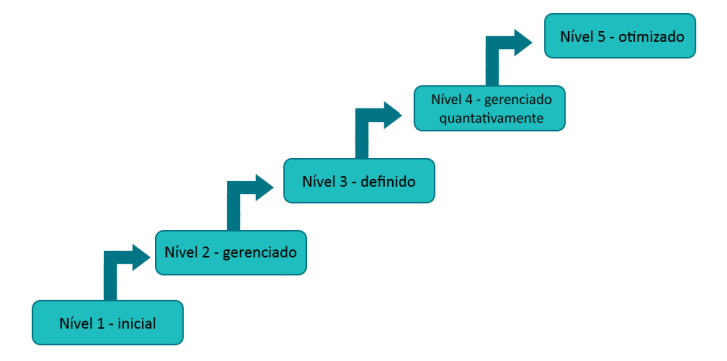
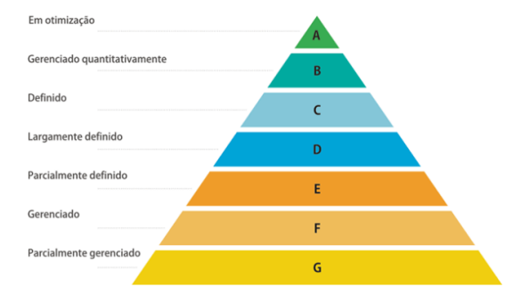

</a>
<h1>Estudando Segurança de Sistemas de Informação.</h1>

Tecnologia da Informação III - ETEC

<h2>Agenda 08: Qualidade de Software.</h2>

## 1. Introdução

### a) `Qualidade`:
- diferentes significados podem ser atribuídos, em
diferentes situações e de acordo com a opinião ou enfoque de quem faz uso.
- exemplo:
  - usuário: interesse concentrado no uso do software.
  - desenvolvedor:qualidade voltada às características internas do software.
  - gerente: qualidade do produto não pode ser desvinculada dos interesses da organização.

### b) `Qualidade Aplicada ao Software`:
- para estudar a qualidade de software, é necessário um consenso em relação à definição que está sendo abordada. 
- há duas definições:
  - "Um produto de software apresenta qualidade dependendo do grau de satisfação das necessidades dos clientes sob todos os aspectos do produto"[Sanders, 1994].
  - "Qualidade de software é a conformidade a requisitos funcionais e de desempenho que foram explicitamente declarados, a padrões de desenvolvimento claramente documentados, e a características implícitas que são esperadas de todo software desenvolvido por profissionais" [Pressman, 1994].
- as definições enfatizam `três aspectos importantes`:
  - 1. Os requisitos de software são a base a partir da qual a qualidade é medida. A falta de conformidade aos requisitos significa falta de qualidade.
  - 2. Padrões especificados definem um conjunto de critérios de desenvolvimento que orientam a maneira segundo a qual o software passa pelo trabalho de engenharia. Se os critérios não forem seguidos, o resultado quase que seguramente será a falta de qualidade.
  - 3. Existe um conjunto de requisitos implícitos que frequentemente não são mencionados na especificação (exemplo: boa manutenibilidade).

Software sem qualidade | Software com qualidade
-----------------------|------------------------
Projetos de software difíceis de planejar e controlar; custos e prazos não são mantidos. | Projetos, prazos e custos sob controle.
A funcionalidade dos programas nem sempre resulta conforme planejado. | Satisfação de usuários, com necessidades atendidas na execução de suas tarefas.
Existem muitos defeitos nos sistemas. | Diminuição de erros nos projetos de software.
A imagem da empresa é prejudicada no mercado, como empresa tecnologicamente atrasada. | Melhoria da posição competitiva da empresa, como instituição capaz de acompanhar a evolução.

### c) `Qualidade de Processo de Software`:
- o dia a dia dna área de desenvolvimento de software é caracterizado por uma grande pressão (prazos de entrega, custos e qualidade). 
- independentemente do tamanho das equipes, muitas organizações possuem dificuldades em gerenciar atividades, sendo comum ocorrer atrasos, estouros orçamentários e sistemas que ficam aquém do
esperado.
- alguns modelos, como o ***CMMI*** e o ***MPS-BR*** foram desenvolvidos para auxiliar a condução de atividades que envolvam projetos de software, baseando-se para isto em um conceito conhecido como "maturidade".
- `Maturidade`:
  - capacidade de se repetir uma série de resultados de uma maneira previsível.
  - os modelos CMMI e MPS-BR contemplam diferentes níveis de maturidade, permitindo mensurar o grau de progresso atingido por uma organização na implementação de projetos de software.

> Um processo representa, dentro da área de software, um conjunto de atividades cujo objetivo é atingir uma meta previamente estipulada. Já por capacidade e maturidade de um processo, deve-se ter a noção do grau de qualidade com o qual um processo atinge um resultado esperado.

## CMMI (Capability Maturity Model Integration):

- criado pelo Software Engineering Institute (SEI), da universidade norte-americana Carnegie Mellon. 

### a) principais benefícios da implantação do CMMI:

- maior confiabilidade em relação ao cumprimento de prazos e custos que foram acordados. Essa previsibilidade é decorrente do rigor que
o CMMI exige quanto à medição dos processos, o que leva à obtenção de uma base histórica realista e confiável.
- o gerenciamento das atividades relativas à produção de software aumenta consideravelmente.
- maior qualidade nos softwares criados, já que processos bem definidos e controlados conduzem à produção de produtos mais confiáveis.
- menor dependência da empresa de desenvolvimento para com seus especialistas. Com um foco voltado para processos e melhoria contínua, além do uso intensivo de informações históricas, a organização deixa de
depender única e exclusivamente de profissionais com elevado grau de conhecimento técnico.
- busca por melhorias contínuas nos processos cotidianos.

### b) níveis de maturidade do CMMI:

- para obter o que este modelo propõe, a organização deverá evoluir progressivamente, considerando uma sucessão de diferentes de níveis. 
- o CMMI está dividido em `5 níveis de maturidade`, que atestam o grau de evolução em que uma organização se encontra num determinado momento. 
- tem por ***objetivo principal*** funcionar como um guia para a melhoria dos processos da organização, considerando atividades como gerenciamento do desenvolvimento de software, prazos e custos previamente estabelecidos.
- o objetivo maior é a produção de software com maior qualidade e menos propenso a erros.

<em>Níveis de maturidade do CMMI.</em>
 

- `Nível 1 - Inicial` (Os processos normalmente estão envoltos num caos decorrente da não obediência ou ainda, à inexistência de padrões).
- `Nível 2 - Gerenciado` (Os projetos têm seus requisitos gerenciados neste ponto. Além disso, há o planejamento, a medição e o controle dos diferentes processos).
- `Nível 3 - Definido` (Os processos já estão claramente definidos e são compreendidos dentro da organização. Os procedimentos se encontram padronizados, além de ser preciso prever sua aplicação em diferentes projetos).
- `Nível 4 - Gerenciado Quantitativamente` (Ocorre o aumento da previsibilidade do desempenho de diferentes processos, uma vez que eles já são controlados quantitativamente;).
- `Nível 5 – Otimizado` (Existe uma melhoria contínua dos processos.).

### c) concluindo...

- a implantação do CMMI é recomendável para grandes fábricas de software. 
- implementar os diversos estágios é uma tarefa árdua, não só numa fase inicial, mas também quando se leva em conta a migração de
um nível para outro. Isto exigirá a realização de vultosos investimentos financeiros, assim como uma mudança de postura da organização (principalmente quando a mesma não contava uma experiência anterior bem-sucedida no gerenciamento de processos).
- em inúmeras ocasiões, empresas desenvolvedoras de sistemas recorrem a consultorias especializadas, visando apoio na obtenção da certificação CMMI (fato este que inviabiliza a adoção deste mesmo modelo por pequenas companhias).

## MPS-BR (Melhoria do Processo de Software Brasileiro)

- metodologia voltada à área de desenvolvimento de sistemas.
- criada por um conjunto de organizações ligadas ao desenvolvimento de software. Dentre as instituições, há a Softex (SP), a RioSoft (RJ), o COPPE/UFRJ (RJ) e o CESAR (PE), organizações normalmente não-governamentais e muitas de origem acadêmica, de atuação de destaque junto à comunidade de software brasileira.

### a) características:

- enfatiza-se o uso das principais abordagens internacionais voltadas para a definição, a avaliação e a melhoria dos processos de software, o que torna o `MPS-BR compatível inclusive com as práticas do CMMI`.
- possui uma estrutura de níveis de maturidade, de forma similar à do CMMI.

### b) níveis de maturidade do MPS-BR:

- são 7 níveis.
- cada classificação atesta diferentes graus no controle de processos e qual a qualidade que se pode esperar da organização que a detém.

<em>Níveis de maturidade do MPS-BR.</em>
 

- `A – Em Otimização`: há a preocupação com questões como inovação e análise de causas.
- `B – Gerenciado Quantitativamente`: avalia-se o desempenho dos processos, além da gerência quantitativa dos mesmos.
- `C – Definido`: onde ocorre o gerenciamento de riscos.
- `D – Largamente Definido`: envolve verificação, validação, além da liberação, instalação e integração de produtos, dentre outras atividades.
- `E – Parcialmente Definido`: considera processos como treinamento, adaptação de processos para gerência de projetos, além da preocupação com a melhoria e o controle do processo organizacional.
- `F – Gerenciado`: introduz controles de medição, gerência de configuração, conceitos sobre aquisição e garantia da qualidade.
- `G – Parcialmente Gerenciado`: neste ponto deve-se iniciar o gerenciamento de requisitos e de projetos.

### c) concluindo...
- a certificação MPS-BR também tem sido solicitada em licitações governamentais; empresas interessadas em participar de projetos conduzidos por órgãos do governo podem se utilizar desta metodologia para ampliar seu ramo de atuação.
- pode-se considerar o MPS-BR como uma importante alternativa ao CMMI em organizações de médio e pequeno porte, em virtude do alto investimento financeiro que o CMMI representa, o que torna o mesmo mais indicado às grandes empresas de desenvolvimento!

---

<h2>Você no Comando</h2>

> Serão acompanhados dois estudos de caso, onde foram aplicados Modelos CMMI e MPS-BR, realizado por estudantes da FATEC de São José dos Campos. 

## 1. ESTUDO DE CASO CMMI - BMO FINANCIAL GROUP

- o Banco de Montreal é o banco privado mais antigo do Canadá, criado em 1817, em Montreal, Quebec.
- atualmente, está sediada na cidade de Toronto. 
- possui mais de 1,1 mil estabelecimentos bancários espalhados mundialmente e possui mais de 33 mil funcionários.
- conhecido pela inovação e por desenvolvimento e melhorias contínuas em software. 
- buscou o `CMMI` para continuar líder em produtividade e efetividade de suas ações. 

### a) Seus maiores desafios foram: 

- empresas buscando diminuição dos custos, resultando em projetos fracassados.
- problemas no BMO e o desenvolvimento voltado para apagar os incêndios.
- prazos e custos de projetos que sempre ultrapassavam as previsões.
- alguns procedimentos de software estavam definidos, mas não estavam estabelecidos, controlados e totalmente documentados. Além de estarem incompletos, de diferentes formatos e padrões, dificultando ser encontrado.

### b) As soluções encontradas para mitigar os problemas na empresa foram:

- reconhecer o problema.
- vice-presidente estabeleceu treinamentos em CMM (Capability Maturity Model - Modelo de Maturidade em Capacitação, definido como sendo uma soma de "melhores práticas" para diagnóstico e avaliação de maturidade do desenvolvimento de softwares em uma organização) e verificações de qualidade foram se espalhando para outras unidades da empresa.
- verificou-se que implementar alguns processos de controle baixou 50% o número de bugs. 
- combinando normas ISO com uma aproximação dos níveis de maturidade do CMMI determinou o que se podia conseguir com pessoas.
- aumentar a efetividade de cada processo e iniciar melhorias. 

### c) Implementação adotada pela empresa:

- procurou parceiros para reconhecer níveis de maturidade, logo após, treinamento para minimizar problemas de qualidade e confiança em relação aos níveis de maturidade obtidos.
- aos poucos foram sendo estabelecidos controles nas áreas de conhecimento, e treinamento em ferramentas, etc.
- o sucesso da implementação só ocorreu pelo comprometimento de superiores e mudança da cultura central da empresa.
- ao atingir o nível de Maturidade, foi possível mensurar exatamente as melhorias que o processo de implantação trouxe.

### d) Resultados:

- produtividade 3,8 vezes maior do que a média da indústria.
- aumento de produtividade mais que 50% maior que a média.
- redução de defeitos por “release” de 6 a 12 para apenas 2.
- aumento da produtividade por ponto de função x funcionário acima da média da indústria.

### d) Conclusão:

- o sucesso na implementação traz ótimos resultados, mas depende de uma forte liderança e mudanças culturais. 
- BMO foi a segunda empresa canadense a atingir o nível 3 do CMMI e o
primeiro banco canadense a atingir o nível 4. 
- a possibilidade de aplicação em larga escala e a disponibilidade
de um parceiro de implantação próximo, dando contínuo feedback dos benefícios reais da implantação, tornaram o projeto bem-sucedido.

## 2. ESTUDO DE CASO MPS-BR: EMPRESA DIGIFRED SISTEMAS PARA GESTÃO PÚBLICA

### a) Sobre a empresa: 

- desde 1986, a Digifred desenvolve softwares que auxiliam o gestor público no gerenciamento de informações municipais em áreas como Administração, Fazenda, Controle, Saúde e Educação. 
- trabalha com sistemas desenvolvidos para atender prefeituras, câmaras de vereadores, autarquias e consórcios.
- para manter-se no mercado altamente competitivo, a Digifred percebeu a necessidade de implementar um modelo formal de processos de software.
- a aplicação do modelo MPS-BR enquadra-se na necessidade da empresa, por conter mais níveis que o CMMI, possibilitando maior visibilidade
na evolução da empresa.

### b) Antes da implementação:

- viu-se como necessária a implementação de um modelo formal para gerenciamento dos processos da fábrica de software, bem como para facilitar e documentar cada processo dos projetos desenvolvidos. Também foi verificado que não existia uma documentação específica a ser aplicada aos projetos na empresa durante seu desenvolvimento. 
- o processo de desenvolvimento de software estava concentrado na competência e experiência dos seus colaboradores. 
- não existia uma formalização e documentação que se enquadrava à
aplicação das práticas nele contidas.

### c) Divisão de papéis e responsabilidades durante a implementação do modelo MPS-BR:

- a diretoria participou como patrocinadora e financiadora da
implementação, disponibilizando os recursos financeiros necessários. 
- um analista de desenvolvimento ficou responsável por coordenar o processo de implementação do modelo.
- um consultor homologado pela Softex acompanhou a implementação.

### d) Implementação do MPS-BR:

- ocorreu no início de outubro de 2013. 
- realizada de forma individual, ou seja, não participou de um grupo de empresas para a implementação.
- a empresa buscou certificação no nível G do modelo, com intuito de melhorar os processos da fábrica de software, seguindo um cronograma de
implementação.

### e) Atividades para a implementação do MPS.BR nível G na empresa:

- Workshop e Diagnóstico Inicial: realizado um workshop com a empresa, onde foram apresentadas as características do modelo MPS.BR, nível G.
- Treinamentos: a SOFTEX disponibilizou um treinamento sobre a implementação do modelo MPS.BR nas empresas, onde foram abordadas algumas melhorias que podem ser alcançadas caso a empresa consiga a certificação. 
- Avaliação feita pela SOFTSUL - Implementadora credenciadas do modelo MPS no Rio Grande do Sul: a empresa foi submetida a uma avaliação de seus processos de desenvolvimento, onde foi abordado um projeto desenvolvido recentemente e avaliado se o mesmo atende a algum processo
do modelo MPS.BR para nivelar a empresa.
- Relatórios de Avaliação das GPRs (Gerência de Projetos) e GREs (Gerência de Requisitos).
- Início do processo de implementação: escolhidos os responsáveis pela implementação na empresa e os projetos-piloto, que passaram por avaliação no marco de 50% de implementação.
- Reuniões: a cada 15 dias, onde foram abordados assuntos como levantamento de evidências para aplicação em todas as fases do
processo produtivo em projetos-piloto, processos, tipos de projeto, ciclo de vida dos projetos a ser utilizado, definição do processo produtivo, entre outros.
- Implementação do processo produtivo: executaram-se todas as fases definidas no ciclo de vida do projeto, em um projeto-piloto. A empresa optou pela utilização do modelo Cascata, que possui as fases de iniciação, planejamento, execução e encerramento.
- Avaliação do Marco de 50%: foi avaliado o projeto piloto, selecionado com relação aos Resultados de Atributo de Processo (RAPs). As RAPs, por sua vez, são resultado de atributos de processo que devem ser atendidos de forma obrigatória pelo projeto que está passando por avaliação, para que o mesmo possa ser aprovado. A avaliação buscou evidências de que o projeto, atendia as 19 GPRs e 5 GREs correspondentes ao nível G do modelo MPS.BR.
- Ajustes após a avaliação.
- Seleção de novos projetos-piloto.
- Avaliação final: a empresa conseguiu a certificação.

### f) Resultados:

- a empresa alcançou seu objetivo de atestar a qualidade dos processos de desenvolvimento de software utilizados por ela.
- outro fator importante foi a melhor definição dos papéis e responsabilidades dos colaboradores que participam de um determinado projeto.
- com relação à documentação dos projetos, podem ser citados os controles implantados na ferramenta SISCOD que auxilia o controle e o andamento dos projetos na empresa. A partir desta ferramenta, é possível
manter uma base histórica do andamento dos projetos, envolvendo tempo de desenvolvimento, colaboradores que participaram e o tempo gasto para o desenvolvimento dos mesmos. 
- com base nestes dados, a empresa consegue elaborar, adequadamente, novos orçamentos para os clientes, o que diminui a margem de erros, tanto financeiros quanto de prazos.
- após três meses da certificação no nível G do MPS.BR, a equipe já estava adequada ao método e os processos fluindo de acordo com a definição do modelo. 
- analisando o período de setembro a novembro de 2014, três meses após a certificação no nível G, pode ser relatado um número de 95 manutenções do software para correção de defeitos.
- comparando com o período de junho a agosto de 2014, período anterior à certificação no modelo MPS.BR na empresa, quando foram relatadas cerca de 141 manutenções nos softwares para correção de defeito, identifica-se uma diminuição de cerca de 32,62% nas alterações no software para correções de defeitos.
- durante a implementação, foram identificadas algumas dificuldades, como a mudança na cultura da empresa e dos funcionários, com relação à adequação aos novos processos. No começo, houve resistência por parte de alguns colaboradores.
- outro ponto importante é a definição dos papéis e responsabilidades que são adotados a cada novo projeto desenvolvido pela empresa. Por meio da definição dos papéis e responsabilidades, todos os participantes do projeto sabem o que, quando e como cumprir com suas atribuições.

---

## Debate

<em>
"Com base nos processos CMMI, vamos debater sobre a implantação dos processos de Qualidade de Software dentro de uma empresa fabricante de Software de pequeno porte.
 
É comum não existirem recursos e pessoal habilitado dentro de empresas menores, por que seria importante realizar a implantação dos processos de Qualidade de Software?
 
Caso não seja possível implantar todo o processo, o que poderia ser definido como essencial para que essas empresas tenham algum parâmetro de qualificação em testes de software?
 
Indique e comente qual ou quais níveis de maturidade do MPS-BR poderiam ser implantados numa empresa de pequeno porte desenvolvedora de software."
</em>

---

[Voltar ao início!](https://github.com/monicaquintal)