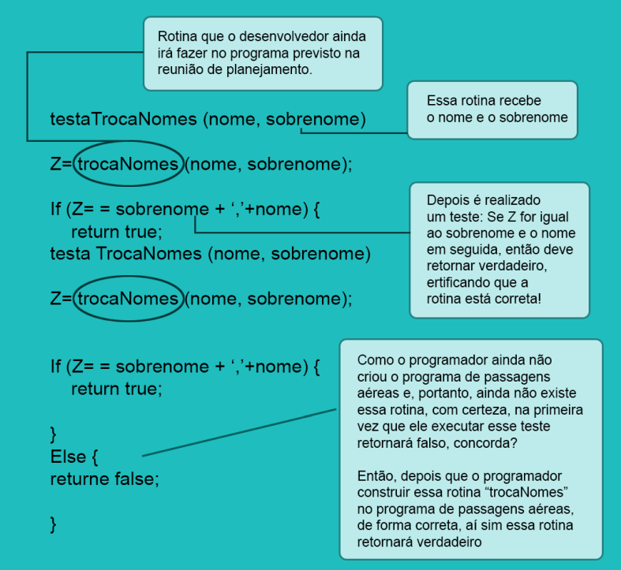
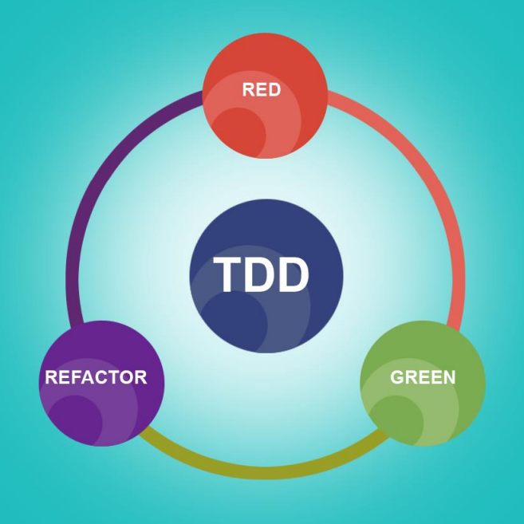

</a>
<h1>Estudando Segurança de Sistemas de Informação.</h1>

Tecnologia da Informação III - ETEC

<h2>Agenda 09: Testes de Software.</h2>

## 1. Introdução

- `qualidade de software`: o objetivo é garantir que tanto o processo de desenvolvimento quanto o produto de software atinjam os níveis de qualidade especificados.
- para isso, é necessário levar em consideração o `VV&T` (Validação, Verificação e Teste):
  - ***Validação***: 
    - Estamos construindo o produto certo? 
    - A validação consiste em assegurar que o produto final corresponda aos requisitos do usuário.
  - ***Verificação***: 
    - Estamos construindo corretamente o produto?
    - A verificação consiste em assegurar consistência, completude e corretude do produto em cada fase e entre fases consecutivas do ciclo de vida do software.
  - ***Teste***: examina o comportamento do produto por meio da sua execução.

## 2. Teste de Software

-  é um processo de checagem aplicado a programas de computador em diversas fases do desenvolvimento. 
- é um controle de qualidade que pode envolver etapas, desde a escolha das condições em que a aplicação será colocada à prova, até a simulação de uso real dela e o desenvolvimento de relatórios sobre os resultados obtidos.
- ***propósito***: verificar se o produto corresponde às funcionalidades esperadas no desenvolvimento e às necessidades dos usuários.
- ***qual a importância dos testes de software?*** Ajuda que o seu time encontre pequenos erros que atrapalham a emissão de documentos fiscais e bugs que levem à perda de desenvolvimentos avançados.
- trata-se de uma etapa essencial para que o produto final seja entregue ao cliente funcionando dentro das expectativas.
- há diversos tipos de testes que podem ser realizados para avaliar diferentes aspectos.

## 3. Principais tipos de teste de software

### a) Teste de Usabilidade:
- de suma importância para avaliar a qualidade do software quanto à experiência do usuário.
- finalidade: compreender o quão intuitivo, compreensível e inteligível é a interface do programa para o usuário final.
- é fundamental a compreensão de como o software será utilizado.
- exemplo: 
  - nem sempre a aplicação é executada em primeiro plano, o que leva a equipe a construir uma interface que permaneça agradável quando redimensionada.
- como os perfis de usuário variam a cada projeto, o teste de usabilidade é realizado com esses grupos de pessoas, de modo que elas opinem acerca da facilidade de uso, das questões visuais (cores, fontes, poluição visual etc.), entre outros detalhes que prejudicam a experiência de uso.

### b) Testes Funcionais:
- consiste em uma série de testes (técnicas), cujo objetivo é atestar se a aplicação é capaz de desempenhar as funções que se propõe a fazer.
- as técnicas mais comuns são os testes:
  - `caixa-branca`: tem como foco a análise do comportamento interno do software, ou seja, o seu código fonte.
  - `caixa-preta`: feito em cima das funções que devem ser desempenhadas pelo programa.

### c) Teste de Integração:
- está entre os principais tipos de teste de software.
- finalidade: analisar o comportamento do software quando interage com outras aplicações ou processos. 
- há diversas situações em que os testes de integração se mostram úteis: quando o software se comunica com um banco de dados ou servidor que estabelece a conexão dele com a internet, por exemplo.
- a ideia é compreender se o processo em questão gera alguma falha/instabilidade. O mesmo vale para aplicações a serem utilizadas em cooperação pelo usuário final.

### d) Testes de Performance:
-  são uma série de análises voltadas para o desempenho do software mediante várias situações.
- a partir dos diagnósticos, a equipe é capaz de compreender os limites do programa sob diversas condições.
- para constatar a qualidade da aplicação, ela é submetida a avaliações que simulam eventos e situações previsíveis de acordo com a rotina do cliente, ou seja, testes de carga, estresse e estabilidade. 
- quaisquer falhas detectadas durante o teste são corrigidas pela equipe precisa e cirurgicamente.

### e) Teste de Carga e Estresse:
-  o software, assim como o hardware, pode apresentar problemas quando recebe cargas altas de processos e requisições.
- isso acontece para mensurar se as condições nas quais ele será submetido não vão comprometer o seu desempenho.
- imprevisivelmente, a sobrecarga pode acontecer durante a utilização, gerando o que chamamos “estresse”. 
- para descobrir o nível de tensão capaz de levar o software a parar de funcionar, é executado o teste de estresse, que consiste em simular eventos de carga excessiva, forçando o software ao extremo.

### f) Teste de Estabilidade:
- a partir do momento em que se planeja construir um software para o cliente, é necessário que o produto final apresente certa estabilidade, condizente com a carga de trabalho a ser suportada diariamente.
- o ideal é que o software não sofra perda de performance depois de determinado tempo de uso.

### g) Teste de Regressão:
- é uma metodologia usada, entre outras coisas, para evitar a recorrência de um erro.
- exemplo: quando o programador modifica o código, seja para eliminar um bug ou acrescentar funcionalidades, e procura identificar falhas até então inexistentes.
- isso pode acontecer em função de problemas previamente corrigidos em uma versão anterior. 
- o teste de regressão é essencial para impedir que um sistema, após um update, assim que as atualizações forem instaladas, fique instável.

### h) Teste de Segurança:
-  é um dos mais importantes da lista, sobretudo quando falamos em software corporativo. 
- a proteção dos dados é imprescindível a toda e qualquer empresa que armazena informações no ambiente virtual — que é repleto de ameaças.
- esse teste é realizado por uma equipe especializada em Segurança da Informação, incumbida de avaliar se há brechas de segurança a partir de procedimentos, como análise de vulnerabilidade, coleta de informações e violação de senha.
- dessa maneira, o produto final só é entregue ao cliente quando os requisitos de segurança são devidamente preenchidos, garantindo à empresa que suas informações ficarão protegidas contra invasão cibernética.

## 4. TDD - TEST DRIVEN DEVELOPMENT / DESENVOLVIMENTO ORIENTADO A TESTE

- é parte da metodologia XP (Extremme Programming), também utilizado em diversas outras metodologias, além de poder ser utilizada livremente.
- o TDD transforma o desenvolvimento, pois deve-se primeiro escrever os testes, antes de implementar o sistema. 
- os testes são utilizados para facilitar no entendimento do projeto, usados para clarear a ideia em relação ao que se deseja em relação ao código.
- é a forma de "separar o projeto lógico do físico".
- a criação de teste unitários ou de componentes é parte crucial para o TDD. 

> "Os componentes individuais são testados para garantir que operem corretamente. Cada componente é testado independentemente, sem os outros componentes de sistema. Os componentes podem ser entidades simples, como funções ou classes de objetos, ou podem ser grupos coerentes dessas entidades.

- não é só o teste unitário que vai trazer o sucesso à aplicação, é necessário testar o sistema como um todo.
- "Os componentes são integrados para compor o sistema. Esse processo está relacionado com a busca de erros que resultam das interações não previstas entre os componentes".
- um sistema é um conjunto de unidades integradas, por este motivo é importante os testes unitários para ver se no micromundo tudo funciona, mas também temos de testar a integração, ou seja, ao integrar dois ou mais componentes, devemos realizar testes para verificar se a integração funciona.
- ***o que se ganha com isso?*** 
  - qualidade no código.
  - código mais simples e organizado.
  - documentação mais clara (componentização).

## 5. Exemplo

- imagine que um programador tenha saído da reunião de planejamento de sprints com o seguinte requisito:
  - dado um nome e sobrenome, o sistema deverá inverter a ordem, colocando o sobrenome do usuário e depois o nome, assim como acontece com os passaportes, citação de autores em trabalhos científicos e em demais situações.
  - para isso, o programador irá criar um programa de teste com o nome “trocaNomes”.

 

<em>Rotina de teste para a função trocaNomes().</em>

 

- assim funciona um teste unitário do TDD – fazer uma rotina ou classe do método que o programador ainda irá construir.
- observamos que:
  - a rotina falhou na primeira execução porque ainda não existia a codificação.
  - a rotina de teste passou a funcionar porque o código foi programado corretamente.
  - depois o programador codificou o futuro programa; dessa forma, consegue testar o funcionamento da rotina do seu sistema, por meio do programa de teste.
- além de tudo, os programas testes auxiliam na documentação do sistema, pois nele o programador está expressando exatamente aquilo que deverá ser implementado e os resultados almejados para o sistema.

## 6. Vantagens em adotar o TDD:

### a) `Design e Manutenibilidade`: 
- quando o TDD guia a implementação de um software, esse software terá um desenho menos complexo e com características altamente modularizáveis, porque será forçado a escrever códigos limpos e desacoplados, evitando possíveis erros antes que chegue ao usuário final.

### b) `Confiança`: 
- rotinas já testadas. 
- confiança para fazer alterações no código sem temer que possa acontecer algum problema.

### c) Documentação: 
- as descrições que são escritas nos testes documentam os requisitos que foram
implementados.

### d) Redução de bugs em produção: 
- estudos comprovam que a prática do TDD, além dos benefícios mencionados, impacta de 40 a 80% de redução dos bugs em produção.

 

<em>Ciclo de um TDD.</em>

 

- O `processo de desenvolvimento com TDD` é sempre: Red, Green e Refactor.

### a) Red:
- o primeiro passo é escrever um teste que falha.
- escrevemos o programa teste primeiro para depois escrever realmente as rotinas do sistema que se pretende desenvolver.
- depois execute o teste e acompanhe a falha. 
- pode ser um código falso mesmo que retorne o erro. 

### b) Green:
-  desenvolva primeiro a solução mais simples, depois teste novamente e se o teste não passar/der errado, retorne à etapa anterior.

### c) Refactor:
- refatore a funcionalidade e agora escreva-a por completo. 
- nessa etapa, elimine redundância e acoplamentos deixando o design do código mais limpo e legível.
- e pronto! Passe para a próxima funcionalidade iniciando um novo teste!

## 7. TESTES DE SOFTWARE COM O METODOLOGIA SCRUM NA LINHA DE FRENTE

- dentro de um time scrum, todos são responsáveis por tudo, ou seja, os papéis são compartilhados, portanto a responsabilidade não é apenas dos analistas de testes, mas de todo o time.
- no Scrum, todos são testers e todos são desenvolvedores.
- em oposição à metodologia tradicional, onde as especificações e requisitos dirigem os testes, no Scrum os testes são aplicados com maior ênfase nas partes que mais geram valor para o produto.
- a equipe segmenta o projeto em pequenas features/tasks, aumentando a compreensão sobre a utilidade e prioridade dos itens, visto que a divisão em pequenos pedaços instiga a criticar sobre a contribuição de cada um para o todo.

> “Não pense em todo o produto! "Vá por partes!"

- assim, a decisão do time sobre o que deveria ser priorizado torna-se mais assertiva, já que tem a ciência de que aquilo que foi e que seria testado contribuiria para o projeto.

## 8. QUAIS FERRAMENTAS UTILIZAR PARA IMPLEMENTAR O PROCESSO DE TDD AO DESENVOLVIMENTO?

- não existe uma perspectiva das melhores ou piores ferramentas e/ou linguagens. 
- é possível usar qualquer linguagem de programação para fazer os programas testes, escolhendo a opção mais próxima da sua realidade de conhecimento e habilidades técnicas dentro da sua equipe. 
- no entanto, existem diversas ferramentas que nos fazem ganhar mais tempo. 
-  exemplos para diferentes linguagens:
  - ***JUnit***: framework de teste para Java, permite a criação de testes unitários. Disponível como plug-in para os mais diversos IDE'S como Eclipse, Netbeans etc.
  - ***TesteNG***: ferramenta de teste unitária disponível para Java.
  - ***PHPUnit***: Framework XUnit para teste unitário em PHP, também é possível integrar aos IDE's assim como o JUnit.
  - ***SimpleTest***: outra ferramenta para realização de teste para PHP. Além de possibilitar os testes unitários, é possível realizar MOCKS e outros testes.
  - ***NUnit***: Framework de teste no molde XUnit para a plataforma .NET.
  - ***Jasmine***: Framework para teste unitário de JavaScript.
  - ***CUnit***: Ferramenta para os testes unitários disponível para Linguagem C.
  - ***PyUnit***: Framework Xunit para testes na linguagem Python.

### Importante:

- as ferramentas de gerenciamento podem ser utilizadas em todas as etapas do ciclo de vida do teste.
- têm como vantagem a centralização de todas as informações relacionadas à evolução dos testes realizados no software, permitindo que  nformações sejam coletadas e acompanhadas, possibilitando uma visão mais ampla para a tomada de decisão, fornecendo artefatos de acordo com os interesses e expectativas.

> Recomendado aprofundamendo dos conhecimentos nas ferramentas [JUnit](https://www.youtube.com/watch?v=V2I-XnesC3A) e [PHPUnit](https://www.devmedia.com.br/teste-unitario-com-phpunit/41231).

---

## Fichário

---

[Voltar ao início!](https://github.com/monicaquintal)