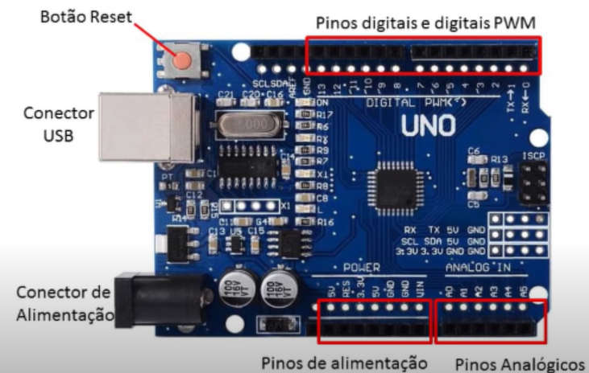
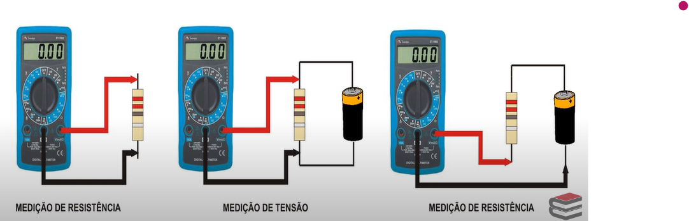
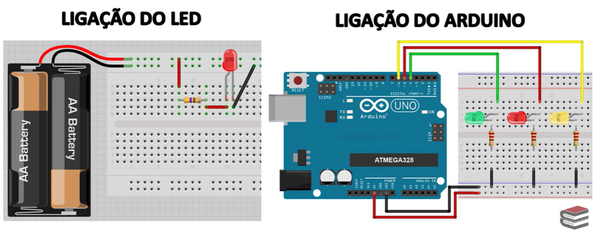

</a>
<h1>Estudando Sistemas Embarcados - Arduino.</h1>

Tecnologia da Informação III - ETEC

<h2>Agendas 10 e 11: Módulo I - Estruturas Básicas.</h2>

- antes de iniciar a aula, acesse o [site](https://mooc.cps.sp.gov.br/ead/course/view.php?id=10) para fazer a inscrição, clicando em Criar uma conta.
- realizado o cadastro e acesso no curso, clicar em "Apresentação" e no menu percorra pelas abas: 1- Boas-vindas,  2- Apresentação, 3- Temas, 4- Baixe aqui.
- iniciar os estudos clicando na imagem e acessando o Módulo I - Estruturas Básicas e percorra pelas abas: - Introdução - Protoboard - Resistores, potenciômetros e leds - Introdução a Lógica de Programação - Estrutura de Programação - Instruções de entrada e saída - Ambiente de Desenvolvimento Arduíno - Experimento 1 finalizando em Experimento 2.
- curso totalmente a distância, com duração de 30 horas, divididas em quatro módulos e uma prova on-line final, obrigatória.

## 1. Apresentação

- `Arduíno` é uma plataforma de prototipagem eletrônica que permite, a partir de uma linguagem de programação, desenvolver eletronicamente objetos inteligentes.
- o curso de Arduino trata-se de uma formação inicial que tem o intuito de capacitá-lo(a) para compreender um pouco mais sobre o universo da programação aplicada a objetos.
- os módulos estão divididos em três partes:
  - 1. Hardware: explica, em detalhes, os componentes eletrônicos.
  - 2. Programação: aborda a introdução à lógica de programação.
  - 3. Aplicação: demonstra os experimentos com o simulador on-line e com o kit físico do Arduino.

## 2. Temas:

### Módulo 1 - Estruturas Básicas

1. Introdução ao Arduino
2. Protoboard
3. LED, resistores e potenciômetro
4. Introdução à lógica de programação
5. Estruturas de programação
6. Instruções de entrada e saída
7. Baixando o software para o ambiente de desenvolvimento Arduino
8. Acendendo e piscando um LED
9. LED com comando

### Módulo 2 - Chaveamento

1. Buzzer e Push Button
2. Estruturas de decisão
3. Estruturas de repetição
4. Semáforo
5. Piano

### Módulo 3 - Sensores

1. Sensores
2. Display de 7 segmentos
3. Controle remoto
4. Caminho de LED com sensor de luz
5. Display de 7 segmentos com sensor de boia

### Módulo 4 - Motores

1. Motores elétricos
2. Motor
3. Motor com potenciômetro

## 3. Baixando:

- se tiver o Kit Arduino Uno e o protoboard, você pode elaborar os projetos fisicamente. 
- caso não tenha, também poderá elaborar todos os experimentos do curso, utilizando o [simulador de Arduino Uno on-line](https://youtu.be/6pvwCNw3zao).
- disponibilizada [apostila](./assets/apostila_Arduino.pdf) para estudos.

---

<h2>Módulo I - Estruturas Básicas.</h2>

## 1. [Introdução](https://www.youtube.com/watch?v=5CrIR7qwpOU)

### a) O que é o Arduino?
- pequeno computador com hardware limitado (consome pouca energia elétrica), livre e de placa única.
- é uma plataforma de prototipagem.
- trabalha com código aberto.
- programação em C (mais rústica, comando simples de serem trabalhados).
- pode ser utilizado por qualquer pessoa interessada em produzir equipamento eletrônico de automação.

### b) Estrutura:

<em>Placa do Arduino.</em>
 

1. ***Pinos digitais***:
  - tensão de 5V.
  - funciona como entrada ou como saída de dados.
  - trabalha com dados binários: 0 (low - 0V) ou 1 (High - 5V).
  - exemplo: se ligar um LED num pino digital, ele acende e apaga.

2. ***Pinos digitais PWM***:
  - tensão de 5V.
  - funciona como entrada ou como saída de dados.
  - trabalha com variação de sinais digitais entre 0 e 255.
  - exemplo: se ligar um LED num pino digital PWM, é possível fazerf uma variação da tensão enviada, e o LED vai aumentando ou diminuindo a luminosidade de acordo com o comando.
  - precisam ser programadas para que enviem o sinal.

3. ***Pinos analógicos***:
  - funcionam apenas como entradas de sinal.
  - quando recebem 5V, o valor da conversão para digital será de 1023, ou seja, é possível ober uma variação de 0 a 1023.

4. ***Botão de Reset***:
  - permite que toda programação implementada pelo usuário (chamada "latente") na placa seja apagada.

5. ***Conector USB***:
  - faz ligação do computador com a placa Arduino.
  - permite a gravação de programas e fornece alimentação elétrica para o funcionamento da placa.

6. ***Conector de alimentação***:
  - permite a alimentação da placa por fonte ou bateria pelo pino Jack.

7. ***Pinos de alimentação*** (portas):
  - **RES**: conectado ao pino Reset; pode ser utilizado para um reset externo da placa (apaga toda a menmória da placa).
  - **3.3V**: fornece tensão de 3,3V para alimentação de shield e módulos externos. Diferente dos pinos digitais, já há alimentação direta na placa, sem se preocupar com a programação.
  - **5V**: fornece tensão de 5V para alimentação de shield e circuitos externos. Diferente dos pinos digitais, já há alimentação direta na placa, sem se preocupar com a programação.
  - **GND**: terra (negativo) - dias embaixo e uma ao lado da porte 13 digital, em cima da placa.
  - **VIN**: alimentação da placa através de shield ou bateria externa. Se alimentada pelo pino Jack, a tensão da fonte estará nesse pino.

## 2. [Protoboard](https://youtu.be/ISTSIdiP2jw):

### a) Multímetro:
- tem a capacidade de medir as ***grandezas elétricas***:
  - tensão elétrica - Volts (V).
  - corrente elétrica - Amperes (A).
  - resistência elétrica - Ohms (Ω).
- o multímetro possui um seletor, onde escolhemos o que desejamos medir (e medições básicas: VOLTS DC, AMPERES DC, VOLTS AC e OHMS).
- possui as pontas de prova (conectores externos ao multímetro que farão a conexão entre o local da medição e o multímetro) e bornes (onde conecta as pontas de prova).
- observação: 
  - AC ou CA (corrente alternada ~).
  - CC (corrente contínua =).

<em>Formas de medição do multímetro.</em>
 

### b) Protoboard:
- uma placa de ensaio ou matriz de contato.
- é uma placa com furos e conexões condutoras para montagem de circuitos elétricos experimentais.
- a grande vamtagem da placa de ensaio na montagem de circuitos eletrônicos é a facilidade de inserção de componentes, uma vez que não necessita de soldagem.
- placa de circuito impresso (PCI): é a placa definitiva, feita após o protótipo realizado no protoboard! Nela, são criadas as trilhas e soldados componentes, sendo definitiva.

<em>Exemplos de usos do Protoboard.</em>
 

## 3. [LED, resistores e potenciômetro](https://youtu.be/aajFyefjleY)

---

[Voltar ao início!](https://github.com/monicaquintal)